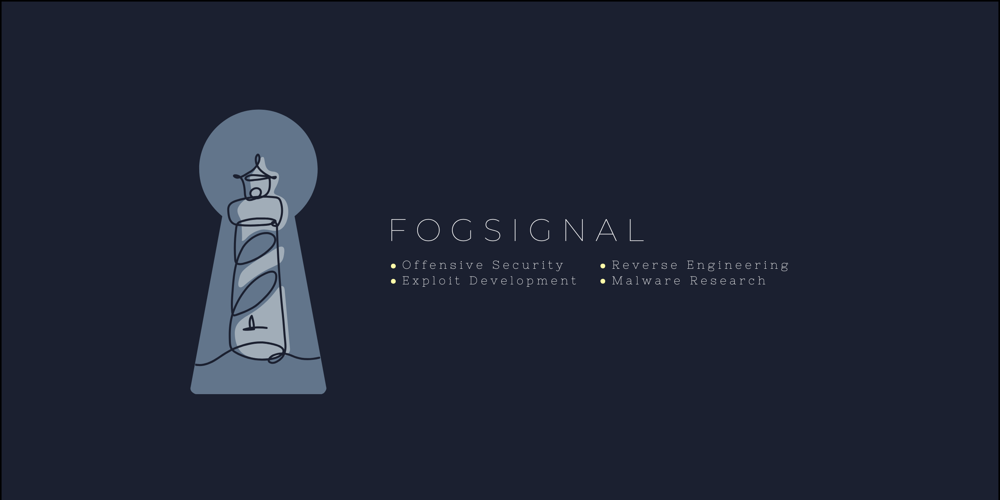
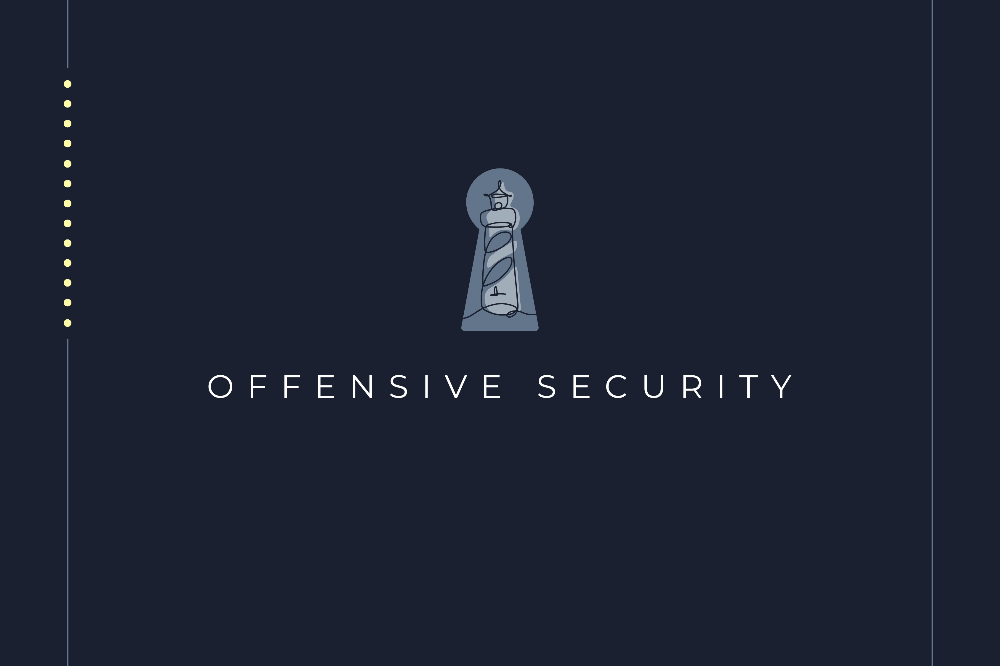
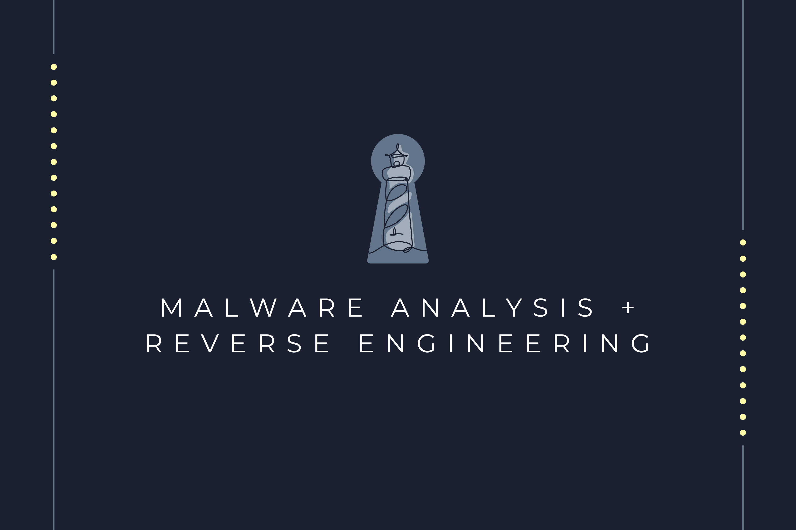
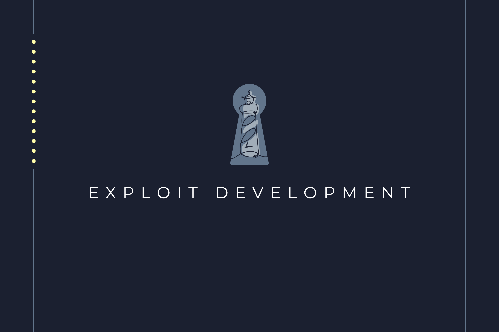

<!-- Banner -->

  

## About

I am a Master’s student exploring offensive security, exploit development, reverse engineering, and malware analysis.  
This repository serves as a portfolio of my projects and research, reflecting my interest in understanding systems by breaking and analyzing them.

---

## Skills

### Offensive / Exploit

### Malware / Reverse Engineering

### Languages / Tools

---

## Projects

A selection of projects demonstrating hands-on exploration of offensive security, reverse engineering, and malware analysis.

  
  
  

## Research & Notes

Write-ups and notes from ongoing exploration and study.

## Contact

_Fogsignal reflects an interest in clarity and guidance in complex systems—understanding what is hidden and signaling it clearly._

## Contact

_Fogsignal reflects an interest in clarity and guidance in complex systems—understanding what is hidden and signaling it clearly._

