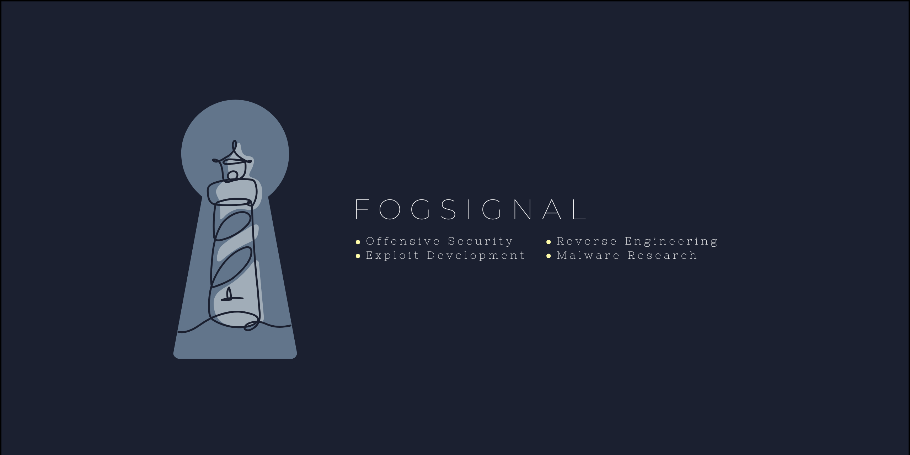
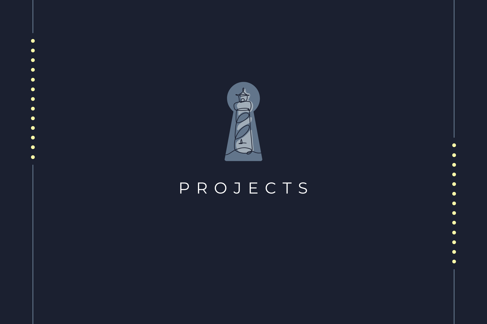
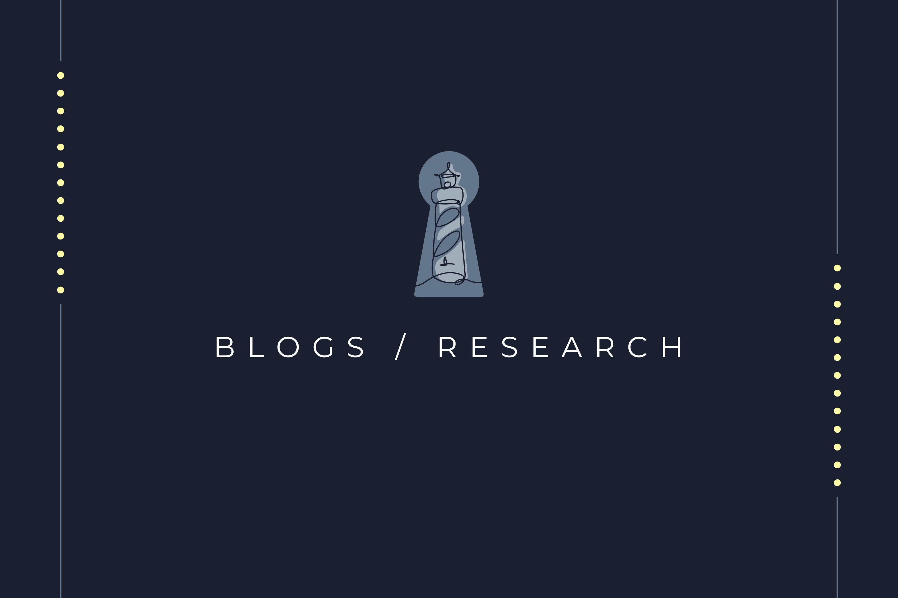

<!-- Banner -->

  

## About

Exploring malware research, reverse engineering, threat analysis, and cybersecurity awareness simulations.

I focus on understanding malicious software behavior, performing lab-based phishing and social engineering simulations, and analyzing cybersecurity risks in controlled environments. My background in cybersecurity (B.S. and ongoing M.S.) provides a strong foundation in systems, networking, and security principles.

This GitHub documents my hands-on labs, research notes, phishing simulations, and projects as I continue building practical skills across malware analysis, adversarial techniques, and human risk management.

---

## Skills / Technologies

### Offensive / Exploit

### Malware / Reverse Engineering

### Human Risk / Awareness

### Languages / Tools

---

## Portfolio

Research and development focused on exploit creation, malware analysis, and attack techniques.

  
  

