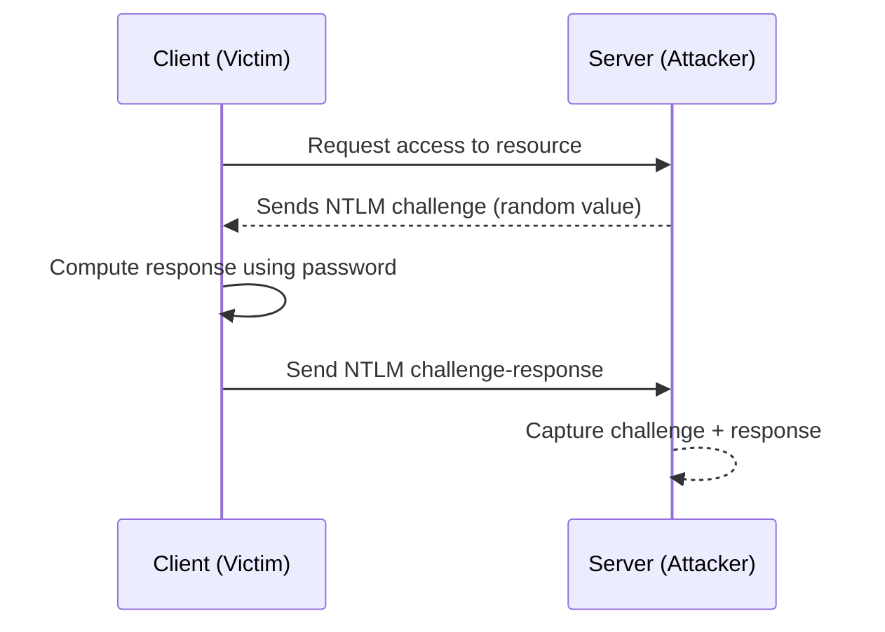
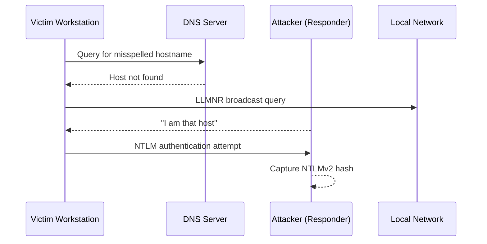

# LLMNR Poisoning

## Objective
Demonstrate how Link-Local Multicast Name Resolution (LLMNR) can be abused to capture NTLMv2 authentication material in an Active Directory environment following DNS resolution failure.

## Background

LLMNR (Link-Local Multicast Name Resolution) is used when DNS fails to resolve a hostname. Windows broadcasts a request on the local subnet asking which system owns the hostname.

LLMNR does not authenticate responses. An attacker on the same subnet can respond to this broadcast and impersonate the requested host, causing the victim machine to attempt NTLM authentication.

## NTLM Challenge-Response Flow

 
NTLM verifies the client's identity, but does not provide mutual authentication. The client proves who it is, but does not verify the legitimacy of the server.

## Attack Scenario

 
A hostname was intentionally misspelled from a domain-joined workstation (\\HarborOpd instead of \\HarborOps).

Because the hostname did not exist in DNS, the system fell back to LLMNR and broadcast a name resolution request on the local subnet. The attacker-controlled machine responded, capturing the NTLMv2 authentication hash.

 

  

*The victim workstation attempts to access a mispelled network share (`\\HarborOpd`). This mistyped share triggers a DNS failure and an LLMNR broadcast, which can be intercepted to capture NTLM authentication hashes.*

 

  
  
  *The NTLMv2 challenge-response hash captured by the attacker machine.*

 

## Offline Password Cracking

The captured NTLMv2 hash was cracked offline using a common password wordlist.

The lab account password followed a common enterprise pattern:
- Capitalized word
- Numeric suffix
- Special character

A simple rule-based transformation was applied to simulate predictable password mutations. This successfully recovered the password.

  

  *Offline hash cracking output demonstrating successful recovery of the lab account password.*

## Why the Attack Succeeded

This scenario succeeded due to the combiantion of:
- LLMNR enabled by default
- Broadcast-based name resolution fallback
- NTLM authentication permitted
- Predictable password construction

No software vulnerabilty was required - only default protocol behavior and common password practices.

## Mitigation Strategies

- Disable LLMNR via Group Policy
- Enforce SMB signing
- Implement strong password policies
- Deploy MFA

<a href="../../../projects/README.md" style="margin:0 10px; text-decoration:none;">Return to Projects Page</a>&nbsp;&nbsp;||&nbsp;
<a href="../README.md" style="margin:0 10px; text-decoration:none;">Return to AD Hacking Main Page</a>&nbsp;&nbsp;||&nbsp;
<a href="" style="margin:0 10px; text-decoration:none;">Go to Next Attack Scenario</a>

