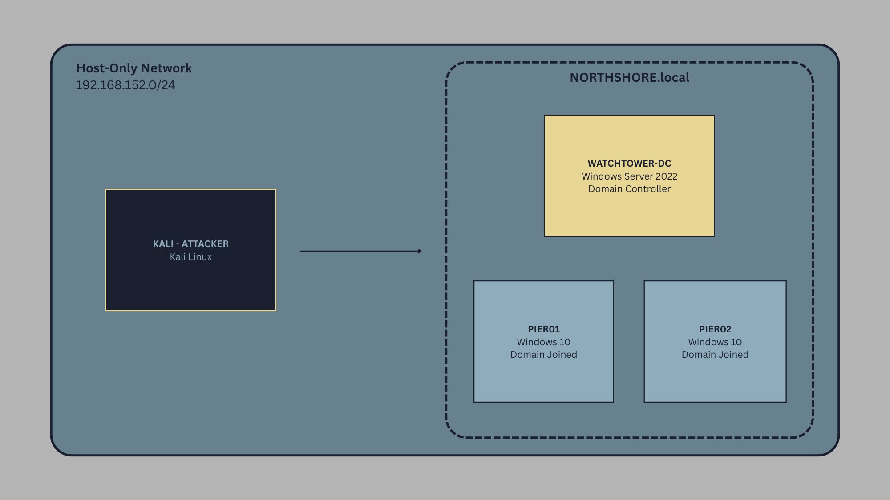

# Overview
This project documents the design, deployment, and compromise of a simulated enterprise Active Directory environment.

The lab was built to practice real-world red team and penetration testing techniques against Windows domain infrastructure, focusing on credential abuse, lateral movement, and privilege escalation.

All attacks were executed in an isolated host-only virtual lab.

## Lab Architecture

    

  
*Network topology for the Active Directory lab environment. `NORTHSHORE.local` is the lab domain. The Domain Controller (`WATCHTOWER-DC`) manages the lab, and the workstations (`PIER01` and `PIER02`) simulate typical users. All machines are within the private lab subnet `192.168.152.0/24`. This diagram is for lab illustration only; no real company or sensitive information is included.*

### Environment

- 1 Domain Controller (Windows Server)
- 2 Domain-Joined Windows Clients
- 1 Attacker Machine (Kali Linux)

### Domain Setup

- Custom AD domain (NORTHSHORE.local)
- Multiple user accounts (standard + service accounts)
- Misconfigurations intentionally introduced for exploitation practice

## Attack Scenarios

### Initial Attack Vectors

- [LLMNR Poisoning](01-llmnr-poisoning/README.md)

### Enumeration

### Post-Exploitation

**Ethical Disclaimer**
This lab was created and attacked in a privately owned, isolated environment for educational and professional development purposes only.

  <a href="../../projects/README.md" align=center> Return to Projects Menu </a>

