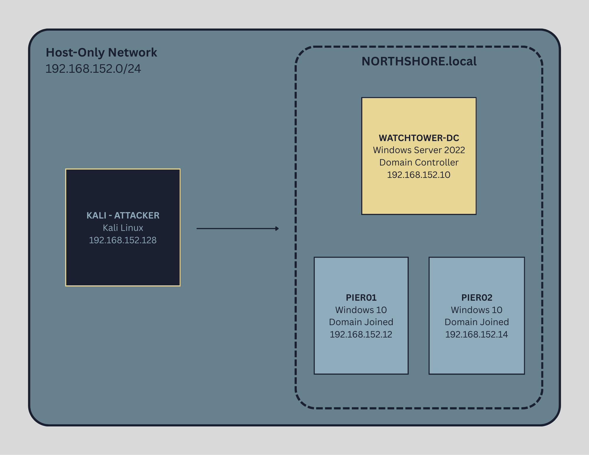

# Overview
This project documents the design, deployment, and compromise of a simulated enterprise Active Directory environment.

The lab was built to practice real-world red team and penetration testing techniques against Windows domain infrastructure, focusing on credential abuse, lateral movement, and privilege escalation.

All attacks were executed in an isolated host-only virtual lab.

## Lab Architecture

  

### Environment

- 1 Domain Controller (Windows Server)
- 2 Domain-Joined Windows Clients
- 1 Attacker Machine (Kali Linux)

### Domain Setup

- Custom AD domain (NORTHSHORE.local)
- Multiple user accounts (standard + service accounts)
- Misconfigurations intentionally introduced for exploitation practice

## Attack Scenarios

### Initial Access

### Enumeration

### Post-Exploitation

**Ethical Disclaimer**
This lab was created and attacked in a privately owned, isolated environment for educational and professional development purposes only.
