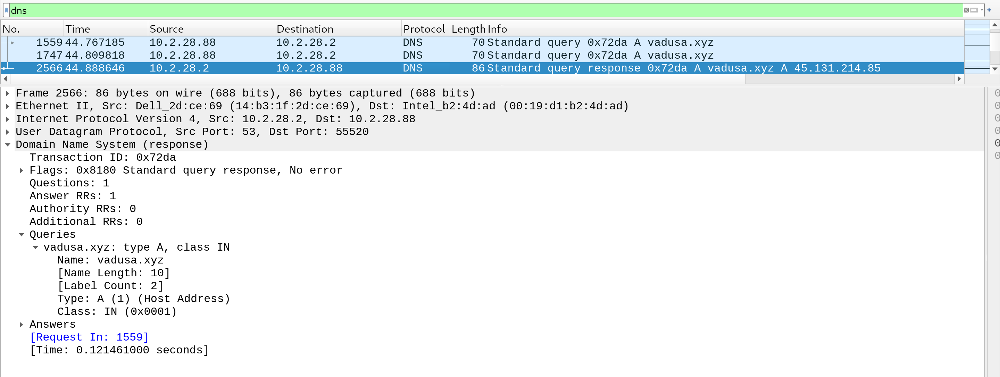
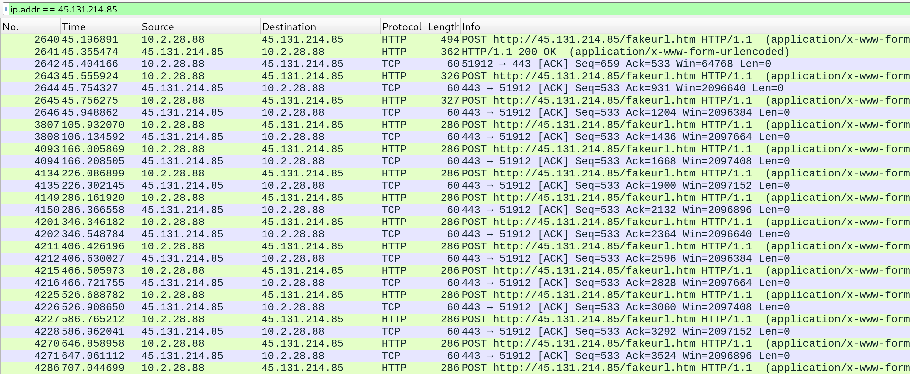
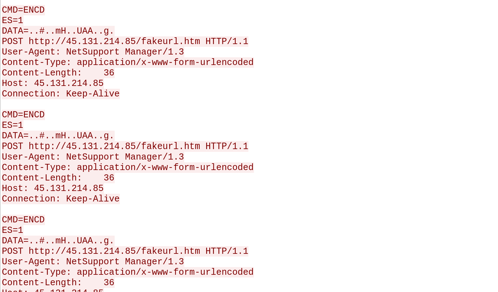

# Malware Traffic Analysis: EasyAs123

## About

This project is part of my hands-on malware research practice. I analyzed a packet capture of a simulated infected Windows machine using Wireshark to identify suspicious traffic, extract indicators of compromise (IOCs), and understand how malware communicates with external servers.

The goal was to get more comfortable reading network traffic and recognizing patterns that indicate malicious behavior like command-and-control (C2) communication.

---

## Lab Setup

- Tool used: Wireshark (REMnux environment)  
- Data source: Malware Traffic Analysis exercise ("Easy as 123")  

---

## Exercise Answers

To identify the infected host, I analyzed internal network traffic and examined packet details in Wireshark.

- **IP address:** 10[.]1[.]28[.]88

&nbsp;&nbsp;&nbsp;&nbsp;&nbsp;&nbsp;&nbsp;&nbsp;&nbsp;The internal IP was identified based on repeated communication with suspicious external infrastructure.

- **MAC address:** 00:19:d1:b2:4d:ad

&nbsp;&nbsp;&nbsp;&nbsp;&nbsp;&nbsp;&nbsp;&nbsp;&nbsp;The MAC address was obtained from the Ethernet II header in the packet details.
  
- **Hostnames:** DESKTOP-TEYQ2NR

&nbsp;&nbsp;&nbsp;&nbsp;&nbsp;&nbsp;&nbsp;&nbsp;&nbsp;The host name was observed in NBNS traffic.

- **User account name:** brolf

&nbsp;&nbsp;&nbsp;&nbsp;&nbsp;&nbsp;&nbsp;&nbsp;&nbsp;Filtering for Kerberos.CNameString identified the user account name.

- **Full name:** Becka Rolf  

&nbsp;&nbsp;&nbsp;&nbsp;&nbsp;&nbsp;&nbsp;&nbsp;&nbsp;The full name was found by using a String search for 'Rolf.'

---

## Identifying Suspicious Domains

While reviewing DNS traffic, I found a suspicious domain using a `.xyz` TLD:

- **Domain:** `vadusa[.]xyz`

This stood out because `.xyz` domains are commonly used in malicious activity due to being cheap and easy to register.

### Screenshot: DNS Query & Response

---

## Resolving to External IP

The suspicious domain resolved to an external IP address:

- **IP Address:** 45[.]131[.]214[.]86  

I used this IP to pivot into further analysis of the traffic between the infected host and the external server.

---

## Repeated HTTP POST Requests

Filtering on the resolved IP showed repeated HTTP POST requests to the same endpoint:

- **Endpoint:** `/fakeurl.htm`

### Screenshot: Repeated POST Requests

These repeated requests suggest automated communication rather than normal user activity.

---

## TCP Stream Analysis (Encoded Payload)

Looking deeper into one of the POST requests using "Follow TCP Stream", I found that each request contained an encoded payload:

`DATA = `

### Screenshot: TCP Stream with Payload

The payload appeared to be consistent across multiple requests, which likely indicates beaconing behavior. The data is likely encoded or obfuscated to avoid detection.

---

## Analysis

Based on the traffic patterns, this activity is consistent with command-and-control (C2) communication:

- The infected host repeatedly connects to the same external IP  
- It sends HTTP POST requests at regular intervals  
- Each request contains encoded data  
- The endpoint (`/fakeurl.htm`) appears non-legitimate  

These findings align with the behavior of remote access trojans (RATs), which maintain persistent communication with a command-and-control server.

According to the SIEM alert in the exercise, this activity may be associated with NetSupport Manager being used maliciously.

---

## Indicators of Compromise (IOCs)

| Type | Value |
|------|------|
| Domain | vadusa[.]xyz |
| IP Address | 45[.]131[.]214[.]85 |
| URL | hxxp://45[.]131[.]214[.]85/fakeurl.htm |

---

## What I Learned

- How to identify suspicious domains using DNS traffic  
- How to pivot from domain → IP → traffic analysis  
- How to recognize repeated traffic patterns (beaconing)  
- How malware uses encoded data to hide communication  
- How to document findings in a structured way  

---

