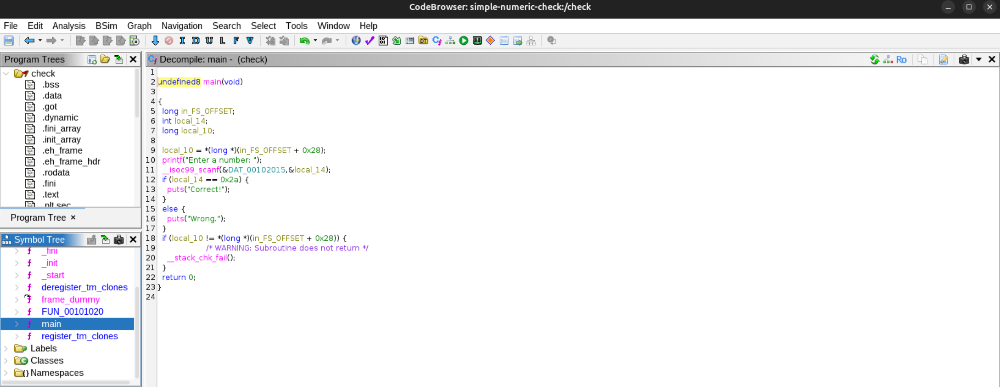

# Reverse Engineering a Simple Numeric Check

**Platform:** Linux x86-64
**Tools:** Ghidra (Decompiler)

---

## Overview 
This project documents the static analysis of a small x86-64 Linux ELF binary that prompts the user for numeric input and compares it against a fixed value to determine program output. The objective was to recover the program's control flow and decision logic using a decompiler.

---

## Analysis Approach
The binary was loaded into Ghidra and analyzed using default analysis settings. The 'main' function was identified by locating standard input/output function calls. The decompiler view was then used to examine how user input is processed and how program behavior is determined. 

---

## Findings
Analysis of the decompiled output revealed the following behavior:

- The program prompts the user for numeric input.
- The input value is stored in a local variable.
- A conditional statement compares the input against a constant value.
- Based on the result of this comparison, the program prints either a success or failure message.

---

### Conclusion
This exercise demonstrates that even simple compiled binaries, retain recoverable high-level logic. Using a decompiler allows program behavior to be understood without directly analyzing assembly instructions. This project serves as a foundational reverse engineering exercise before progressing to binaries with more complex input handling and memory usage.
