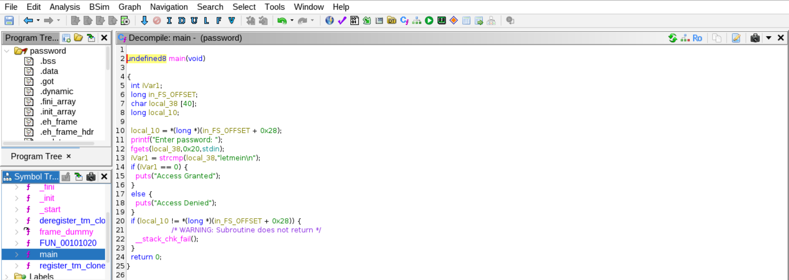
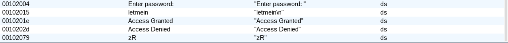

# Reverse Engineering a String-Based Password Check

**Platform:** Linux x86-64
**Tools:** Ghidra (Decompiler)

---

## Overview
This project documents the static analysis of a Linux x86-64 ELF binary that implements a simple string-based password check. The objective was to understand how user input is handled in memory and how the program determines whether authentication succeeds.

--- 

## Analysis Approach
The binary was analyzed using Ghidra's decompiler with default settings. The 'main' function was examined to identify how input is read, how it is stored, and how the validation logic determines program output. 

---

## Findings
Static analysis revealed the following behavior:

- User input is read into a fixed-size character buffer located in the stack.
- The program compares the input against a hardcoded string using a standard string comparison function.
- Program execution branches based on the result of this comparison, printing either an access-granted or access-denied message.

The hardcoded password string was identified by inspecting the binary's string table and following cross-references to the comparison logic.

---

## Conclusion
This exercise demonstrates how stack-based buffers and string comparison logic appear in compiled binaries. It highlights how hardcoded credentials can be recovered through static analysis alone and serves as a foundation for future work involving binary modification and vulnerability research.
